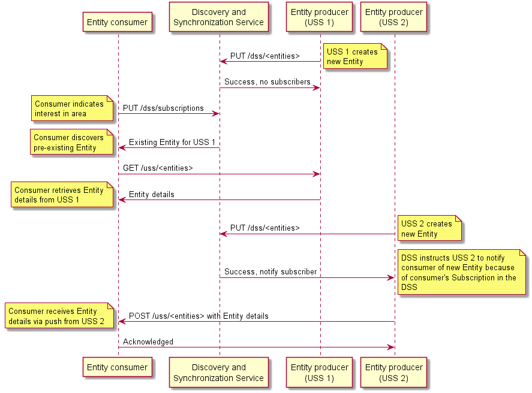
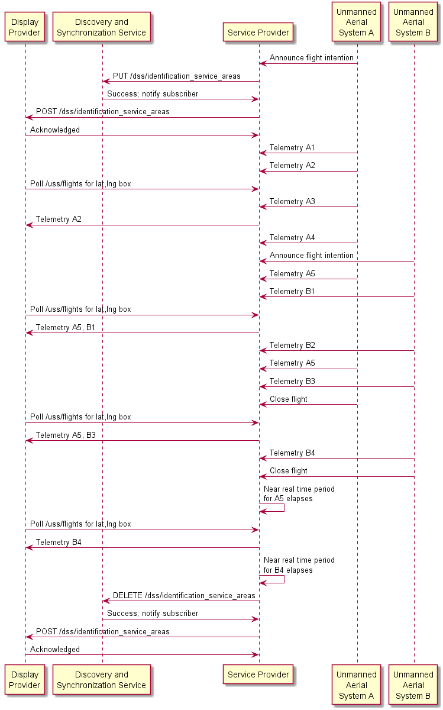
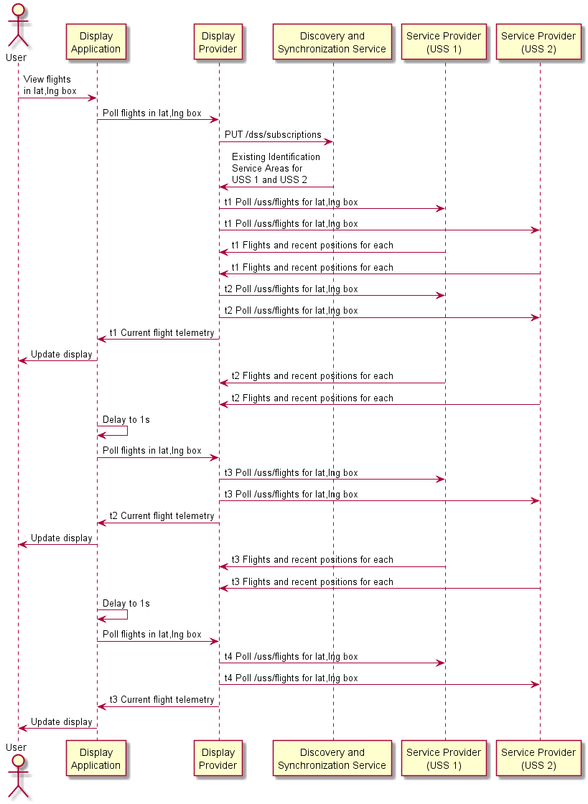

# DSS concepts

## Common Entity design
### Overview
The Discovery and Synchronization Service (DSS) is a federated/distributed concept for facilitating the discovery of relevant airspace data and synchronization between multiple participants when updating airspace data.  All discoverable data is associated with an "Entity" tracked and communicated by the DSS which is characterized by a 4D volume (spatial and time bounds).  Entities can be created in the DSS using Entity-type-specific APIs when the creating UAS Service Supplier (USS) provides:

 * Valid authentication via an access token with an appropriate scope
 * A 4D volume for the Entity
 * Information about how to obtain the data associated with the Entity
 * When necessary, proof of knowledge of required prerequisite information
 * For some Entity types, additional metadata about the Entity when necessary for appropriate DSS behavior

Once an Entity is created in the DSS, it will be discovered by any other USS inquiring about any airspacetime intersecting that Entity's 4D volume.  Existing USSs which have already declared their interest in any airspacetime intersecting that Entity's 4D volume will be made aware of that Entity and its details via the Subscription notifications mechanism.

### Subscriptions
DSS-facilitated Subscriptions allow a USS to indicate interest in a specific 4D volume which will cause them to receive push-based notifications when a relevant change to that airspace occurs.  Subscriptions are facilitated by the DSS, but the DSS does not make any notifications itself.  Subscriptions are notes in the DSS that a USS would like to receive updates for particular things happening in a 4D volume.  When a relevant Entity is changed (created, modified, or deleted), the DSS observes an existing Subscription note and issues an instruction to the USS changing the Entity for that USS to send a notification to the subscriber USS that the Entity has changed.  In accordance with the spirit of the DSS being a facilitator only, rather than the manager or communicator of data directly, the Entity change notifications are therefore sent from USS to USS rather than from the DSS to USS.

In the example sequence diagram below, an Entity consumer (such as a Remote ID Display Provider) discovers a pre-existing Entity (such as an Identification Service Area) from USS 1 as well as an Entity added after the consumer's first query.

### Interoperation
A DSS Region consists of one or more synchronized DSS instances.  From a client perspective, interacting with any DSS instance within the DSS Region is equivalent to interacting with any other DSS instance within the DSS Region.  For instance, an Entity may be written to one DSS instance and then read from a different DSS instance because all DSS instances in a DSS Region share a common DSS Airspace Representation (DAR).  The implementation of the DAR is a single distributed CockroachDB cluster per DSS Region.  The expectation is that multiple separate organizations will each host a DSS instance in the same DSS Region, and each DSS instance will be accompanied with some number of CockroachDB nodes which join into the same cluster.  With a relatively small number of DSS instances, each organization will host a full replica of the CockroachDB database in its nodes.  And in any case, the CockroachDB database will transparently survive the total loss of one or more organizations' DSS instances and CockroachDB nodes as long as there are a sufficient number of DSS instances in the DSS Region.

### Behavioral details
The DSS does not store details of Entities, and specifically it does not store their precise 4D volumes.  Instead, each Entity is mapped into the DSS Airspace Representation (DAR), which happens to be S2 cells at a fixed zoom level currently, and then the precise extents are discarded as required by requirement DSS0040.  This means that true intersection tests between Entities cannot be performed.  If two Entities intersect, they are guaranteed to share at least one common DAR cell.  But, two Entities sharing a DAR cell do not necessarily intersect.  Because the DSS returns all relevant Entities in relevant DAR cells, some Entities that are nearby the area of interest may be returned even though those Entities are, in fact, entirely disjoint from the area of interest.

## Remote ID

### Overview
As specified in the ASTM standard, the DSS facilitates the task of remote identification of aircraft using Entities named "Identification Service Areas" (ISAs), each representing an area in which a Remote ID Service Provider (SP) is providing the required telemetry and information about all the aircraft it is managing which are flying within that area.  Each ISA contains a URL at which a Remote ID Display Provider (DP) may query the SP for information about all flights currently or recently within that area, as well as a URL at which a DP may query the SP for details (such as the aircraft's UAS ID) about a particular flight according to its ID.  A DP discovers and queries all relevant SPs on behalf of a Display Application (DA) client which presents the unified remote ID information to its user.

### Remote ID Service Providers
The role of a Remote ID Service Provider (SP) is to announce the existence of, and provide necessary telemetry for, UAS managed by the SP to other USSs interested in that information.  To accomplish this, the SP ensures that all aircraft it manages are contained within an Identification Service Area recognized by the DSS at all times.  The SP does this by creating new ISAs when necessary, or expanding existing ISAs to encompass new aircraft under management or aircraft movement beyond existing ISAs.  The ISAs specify a URL that may be polled by USSs with a need to see flight data for that relevant flight data, and the SP also has a responsibility to respond correctly to those queries.  An example sequence diagram illustrating SP interactions for two flights in the same area is shown below.

### Remote ID Display Providers and telemetry consumption
End users of remote ID (members of the general public) access remote ID through a Display Application (DA).  A Display Application retrieves telemetry data from a "backend" Display Provider (DP).  Though the API between DA and DP is not standardized, the sequence diagram below assumes polling-based communication.  The DP interacts with the remote ID ecosystem on behalf of the user.  It first contacts the DSS to discover relevant SPs (and likely be notified of future changes in relevant SPs) and then reaches out to each relevant SP for telemetry in the requested area.  An example sequence diagram illustrating the consumption of remote ID data is shown below.

## Strategic deconfliction

Although it is envisioned that the DSS will also coordinate strategic deconfliction during flight planning, this functionality is not currently supported in this implementation of a DSS.  In the future, strategic deconfliction will likely be supported through the use of new types of Entities representing flight operations and non-operation constraints, as well as a synchronization system that ensures anyone planning a new flight operation was aware of all relevant information while planning.
